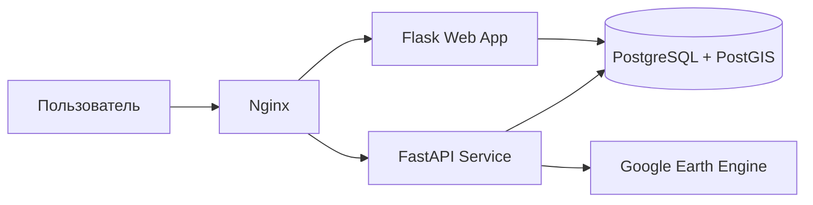

# 🌱 Soil Moisture Monitoring System

Веб-система мониторинга влажности почвы и влагообеспеченности территории на основе спутниковых данных **SMAP NASA** и **Sentinel-2**. Пользователь выбирает область на интерактивной карте, задаёт период анализа, выбирает параметр анализа и получает результат в виде среднего значения, графика, таблицы и картографического слоя.

## Параметры анализа

| Параметр | Источник | Результат |
|---|---|---|
| Влажность почвы SMAP, % | `NASA/SMAP/SPL4SMGP/008`, канал `sm_surface` | Средняя влажность поверхностного слоя почвы |
| Индекс NDMI Sentinel-2 | `COPERNICUS/S2_SR_HARMONIZED`, каналы `B8` и `B11` | Индекс влагообеспеченности поверхности |

> NDMI не является прямым значением влажности почвы в процентах. Он используется как дополнительная детальная картографическая характеристика.

## Основные возможности

- выбор области анализа на карте;
- автоматическое формирование WKT-геометрии;
- выбор периода анализа;
- выбор параметра анализа;
- фоновая обработка через FastAPI;
- получение спутниковых данных через Google Earth Engine;
- хранение запросов и результатов в PostgreSQL/PostGIS;
- отображение статуса выполнения;
- график и таблица значений по датам;
- растровая карта анализа с легендой;
- история выполненных анализов.

## Архитектура



| Компонент | Назначение |
|---|---|
| `nginx` | Reverse proxy и единая точка входа |
| `flask_app` | Веб-интерфейс, история, отправка задач |
| `fastapi_app` | Обработка анализа и интеграция с GEE |
| `postgres_db` | Хранение геометрий, статусов и результатов |
| `PostGIS` | Пространственные типы и геооперации |

## Структура проекта

```text
.
├── docker-compose.yml
├── .env.example
├── README.md
├── db/
│   ├── dockerfile
│   └── init.sql
├── fastapi_app/
│   ├── database.py
│   ├── gee_client.py
│   ├── main.py
│   ├── models.py
│   └── dockerfile
├── flask_app/
│   ├── app.py
│   ├── models.py
│   ├── static/
│   │   ├── app.js
│   │   └── styles.css
│   ├── templates/
│   │   └── index.html
│   └── dockerfile
└── nginx/
    └── nginx.conf
```

## Требования

- Docker;
- Docker Compose;
- Google Cloud project;
- включённый Earth Engine API;
- сервисный аккаунт Google Cloud;
- JSON-ключ сервисного аккаунта.

## Настройка ключа Google Earth Engine

Создайте папку:

```bash
mkdir -p secrets
```

Поместите ключ по пути:

```text
secrets/gee_service_account.json
```

Файл ключа не должен попадать в репозиторий.

## Запуск

```bash
docker-compose up --build
```

После запуска:

```text
http://localhost:8080
```

Документация FastAPI:

```text
http://localhost:8080/docs
```

## Использование

1. Откройте веб-интерфейс.
2. Выберите одну или несколько ячеек на карте.
3. Введите название анализа.
4. Выберите параметр анализа.
5. Укажите даты начала и окончания.
6. Нажмите **Запустить анализ**.
7. Дождитесь завершения обработки.
8. Просмотрите среднее значение, график, таблицу и карту.
9. При необходимости откройте вкладку **История**.

## API

| Метод | URL | Назначение |
|---|---|---|
| `POST` | `/api/submit_analysis` | Создание запроса анализа |
| `POST` | `/api/process` | Запуск фоновой обработки |
| `GET` | `/api/status/{request_id}` | Проверка статуса |
| `GET` | `/api/results/{request_id}` | Получение результатов |
| `GET` | `/api/map/{request_id}` | Получение raster tile layer |
| `GET` | `/api/requests` | История запросов |
| `GET` | `/api/requests/{request_id}/geometry` | Геометрия анализа |
| `GET` | `/api/historical/{lat}/{lon}` | Исторические данные по координате |

## База данных

### `analysis_requests`

Хранит запросы анализа: название, геометрию, период, выбранный параметр и статус.

### `analysis_results`

Хранит результаты по датам: SMAP, NDMI, дату наблюдения и связь с запросом.

## Ограничения

- SMAP имеет крупное пространственное разрешение, поэтому карта может быть обобщённой.
- NDMI является индексом, а не прямым измерением влажности почвы.
- Sentinel-2 зависит от облачности.
- В текущей версии нет авторизации и полноценного мониторинга.
- Для production желательно добавить Alembic, тесты, CI/CD и управление секретами.

## Полезные команды

```bash
docker-compose ps
docker-compose logs -f
docker-compose down
docker-compose down -v
docker exec -it postgres_with_postgis psql -U soil_user -d soil_db
```
