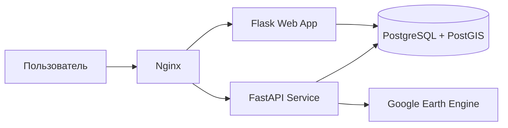

# README-файлы проекта Soil Moisture Monitoring System


---

## FILE: `README.md`

# 🌱 Soil Moisture Monitoring System

Веб-система мониторинга влажности почвы и влагообеспеченности территории на основе спутниковых данных **SMAP NASA** и **Sentinel-2**. Пользователь выбирает область на интерактивной карте, задаёт период анализа, выбирает параметр анализа и получает результат в виде среднего значения, графика, таблицы и картографического слоя.

## Параметры анализа

| Параметр | Источник | Результат |
|---|---|---|
| Влажность почвы SMAP, % | `NASA/SMAP/SPL4SMGP/008`, канал `sm_surface` | Средняя влажность поверхностного слоя почвы |
| Индекс NDMI Sentinel-2 | `COPERNICUS/S2_SR_HARMONIZED`, каналы `B8` и `B11` | Индекс влагообеспеченности поверхности |

> NDMI не является прямым значением влажности почвы в процентах. Он используется как дополнительная детальная картографическая характеристика.

## Основные возможности

- выбор области анализа на карте;
- автоматическое формирование WKT-геометрии;
- выбор периода анализа;
- выбор параметра анализа;
- фоновая обработка через FastAPI;
- получение спутниковых данных через Google Earth Engine;
- хранение запросов и результатов в PostgreSQL/PostGIS;
- отображение статуса выполнения;
- график и таблица значений по датам;
- растровая карта анализа с легендой;
- история выполненных анализов.

## Архитектура



| Компонент | Назначение |
|---|---|
| `nginx` | Reverse proxy и единая точка входа |
| `flask_app` | Веб-интерфейс, история, отправка задач |
| `fastapi_app` | Обработка анализа и интеграция с GEE |
| `postgres_db` | Хранение геометрий, статусов и результатов |
| `PostGIS` | Пространственные типы и геооперации |

## Структура проекта

```text
.
├── docker-compose.yml
├── .env.example
├── README.md
├── db/
│   ├── dockerfile
│   └── init.sql
├── fastapi_app/
│   ├── database.py
│   ├── gee_client.py
│   ├── main.py
│   ├── models.py
│   └── dockerfile
├── flask_app/
│   ├── app.py
│   ├── models.py
│   ├── static/
│   │   ├── app.js
│   │   └── styles.css
│   ├── templates/
│   │   └── index.html
│   └── dockerfile
└── nginx/
    └── nginx.conf
```

## Требования

- Docker;
- Docker Compose;
- Google Cloud project;
- включённый Earth Engine API;
- сервисный аккаунт Google Cloud;
- JSON-ключ сервисного аккаунта.

## Настройка ключа Google Earth Engine

Создайте папку:

```bash
mkdir -p secrets
```

Поместите ключ по пути:

```text
secrets/gee_service_account.json
```

Файл ключа не должен попадать в репозиторий.

## Запуск

```bash
docker-compose up --build
```

После запуска:

```text
http://localhost:8080
```

Документация FastAPI:

```text
http://localhost:8080/docs
```

## Использование

1. Откройте веб-интерфейс.
2. Выберите одну или несколько ячеек на карте.
3. Введите название анализа.
4. Выберите параметр анализа.
5. Укажите даты начала и окончания.
6. Нажмите **Запустить анализ**.
7. Дождитесь завершения обработки.
8. Просмотрите среднее значение, график, таблицу и карту.
9. При необходимости откройте вкладку **История**.

## API

| Метод | URL | Назначение |
|---|---|---|
| `POST` | `/api/submit_analysis` | Создание запроса анализа |
| `POST` | `/api/process` | Запуск фоновой обработки |
| `GET` | `/api/status/{request_id}` | Проверка статуса |
| `GET` | `/api/results/{request_id}` | Получение результатов |
| `GET` | `/api/map/{request_id}` | Получение raster tile layer |
| `GET` | `/api/requests` | История запросов |
| `GET` | `/api/requests/{request_id}/geometry` | Геометрия анализа |
| `GET` | `/api/historical/{lat}/{lon}` | Исторические данные по координате |

## База данных

### `analysis_requests`

Хранит запросы анализа: название, геометрию, период, выбранный параметр и статус.

### `analysis_results`

Хранит результаты по датам: SMAP, NDMI, дату наблюдения и связь с запросом.

## Ограничения

- SMAP имеет крупное пространственное разрешение, поэтому карта может быть обобщённой.
- NDMI является индексом, а не прямым измерением влажности почвы.
- Sentinel-2 зависит от облачности.
- В текущей версии нет авторизации и полноценного мониторинга.
- Для production желательно добавить Alembic, тесты, CI/CD и управление секретами.

## Полезные команды

```bash
docker-compose ps
docker-compose logs -f
docker-compose down
docker-compose down -v
docker exec -it postgres_with_postgis psql -U soil_user -d soil_db
```


---

## FILE: `docs/README.md`

# Документация проекта

Набор README-файлов для проекта **Soil Moisture Monitoring System**.

| ЛР | Тема | Файл |
|---|---|---|
| 1 | Docker и Docker Compose | `lab01-docker-compose/README.md` |
| 2 | PostgreSQL и ORM | `lab02-postgresql-orm/README.md` |
| 3 | REST API | `lab03-rest-api/README.md` |
| 4 | Фронтенд и интеграция с API | `lab04-frontend-api/README.md` |
| 5 | Service Discovery | `lab05-service-discovery/README.md` |
| 6 | Интеграция модулей через микросервисы | `lab06-microservices-integration/README.md` |
| 7 | Тестирование и мониторинг | `lab07-testing-monitoring/README.md` |
| 8 | Финальное развёртывание и защита | `lab08-deployment-defense/README.md` |


---

## FILE: `docs/lab01-docker-compose/README.md`

# Лабораторная работа №1. Основы Docker и Docker Compose

## Цель работы

Освоить контейнеризацию приложения и создать изолированную среду для запуска компонентов системы мониторинга влажности почвы.

## Задачи работы

- создать Dockerfile для Flask и FastAPI
- настроить PostgreSQL/PostGIS
- настроить Nginx как отдельный контейнер
- объединить сервисы через Docker Compose
- добавить volume для хранения данных БД
- проверить запуск приложения

## Реализация в проекте

- создан `docker-compose.yml` с сервисами `nginx`, `flask_app`, `fastapi_app`, `postgres_db`
- для БД используется образ PostGIS и volume `postgres_data`
- все сервисы подключены к сети `app-network`
- внешняя точка входа опубликована на порту `8080`
- Flask и FastAPI доступны внутри сети через `expose`

## Проверка выполнения

```bash
`docker-compose up --build`
`docker-compose ps`
`docker-compose logs -f`
открыть `http://localhost:8080`
```

## Архитектурная связь с проектом

Проект **Soil Moisture Monitoring System** построен как микросервисное приложение. В зависимости от темы лабораторной работы акцент сделан на контейнеризации, базе данных, API, фронтенде, интеграции сервисов, тестировании или финальном развёртывании.

## Результат

Сформирована воспроизводимая контейнерная инфраструктура проекта. Компоненты изолированы, но взаимодействуют внутри общей Docker-сети.

## Вывод

Docker Compose упростил развёртывание системы и обеспечил единый способ запуска всех компонентов.


---

## FILE: `docs/lab02-postgresql-orm/README.md`

# Лабораторная работа №2. Работа с PostgreSQL и ORM

## Цель работы

Спроектировать структуру базы данных, подключить PostgreSQL/PostGIS и реализовать ORM-модели для работы с запросами и результатами анализа.

## Задачи работы

- подключить PostgreSQL/PostGIS
- создать таблицы `analysis_requests` и `analysis_results`
- добавить пространственный тип `GEOGRAPHY`
- реализовать модели Flask-SQLAlchemy
- реализовать модели SQLAlchemy для FastAPI
- проверить запись и чтение данных

## Реализация в проекте

- в `db/init.sql` создаётся расширение `postgis`
- таблица `analysis_requests` хранит геометрию, период, статус и параметр анализа
- таблица `analysis_results` хранит значения SMAP и NDMI по датам
- создан GIST-индекс по геометрии
- модели продублированы во Flask и FastAPI для работы обоих сервисов

## Проверка выполнения

```bash
`docker exec -it postgres_with_postgis psql -U soil_user -d soil_db`
`\dt`
`SELECT id, name, analysis_parameter, status FROM analysis_requests;`
```

## Архитектурная связь с проектом

Проект **Soil Moisture Monitoring System** построен как микросервисное приложение. В зависимости от темы лабораторной работы акцент сделан на контейнеризации, базе данных, API, фронтенде, интеграции сервисов, тестировании или финальном развёртывании.

## Результат

База данных хранит пользовательские запросы, выбранные геометрии и результаты спутниковой обработки.

## Вывод

PostgreSQL/PostGIS подходит для проекта, так как система работает с пространственными данными и временными рядами.


---

## FILE: `docs/lab03-rest-api/README.md`

# Лабораторная работа №3. Разработка REST API

## Цель работы

Разработать REST API для запуска анализа, получения статуса, результатов и картографических слоёв.

## Задачи работы

- реализовать endpoint создания анализа
- реализовать запуск фоновой обработки
- добавить получение статуса
- добавить получение результатов
- добавить получение карты
- обработать ошибки

## Реализация в проекте

- Flask endpoint `POST /api/submit_analysis` создаёт запрос и передаёт задачу в FastAPI
- FastAPI endpoint `POST /api/process` запускает фоновую обработку
- `GET /api/results/{request_id}` возвращает универсальный результат для SMAP или NDMI
- `GET /api/map/{request_id}` возвращает tile URL для Leaflet
- `GET /api/status/{request_id}` возвращает статус обработки

## Проверка выполнения

```bash
`curl http://localhost:8080/api/status/1`
`curl http://localhost:8080/api/results/1`
открыть `http://localhost:8080/docs`
```

## Архитектурная связь с проектом

Проект **Soil Moisture Monitoring System** построен как микросервисное приложение. В зависимости от темы лабораторной работы акцент сделан на контейнеризации, базе данных, API, фронтенде, интеграции сервисов, тестировании или финальном развёртывании.

## Результат

Реализован API, связывающий пользовательский интерфейс, обработку спутниковых данных и базу данных.

## Вывод

REST API позволил разделить frontend, обработку данных и хранение результатов.


---

## FILE: `docs/lab04-frontend-api/README.md`

# Лабораторная работа №4. Фронтенд: визуализация данных и интеграция с API

## Цель работы

Создать интерактивный интерфейс для выбора области анализа, запуска обработки и визуализации результатов.

## Задачи работы

- реализовать карту Leaflet
- добавить выбор области по сетке
- сформировать WKT-геометрию
- интегрировать форму с API
- вывести график и таблицу
- добавить историю анализов
- добавить карту результатов и легенду

## Реализация в проекте

- карта и сетка реализованы в `flask_app/static/app.js`
- форма анализа находится в `templates/index.html`
- графики строятся через Chart.js
- результаты запрашиваются каждые 3 секунды
- история загружается через `/api/requests`
- растровая карта подключается через `L.tileLayer(tilePayload.tile_url)`
- легенда строится по `palette`, `min`, `max`, `units`

## Проверка выполнения

```bash
открыть `http://localhost:8080`
выбрать ячейку
запустить анализ
дождаться графика, таблицы и карты
открыть вкладку `История`
```

## Архитектурная связь с проектом

Проект **Soil Moisture Monitoring System** построен как микросервисное приложение. В зависимости от темы лабораторной работы акцент сделан на контейнеризации, базе данных, API, фронтенде, интеграции сервисов, тестировании или финальном развёртывании.

## Результат

Создан пользовательский интерфейс для полного цикла анализа: выбор области, запуск, ожидание, отображение результата и просмотр истории.

## Вывод

Leaflet и Chart.js обеспечили удобную визуализацию геоданных и временных рядов.


---

## FILE: `docs/lab05-service-discovery/README.md`

# Лабораторная работа №5. Service Discovery

## Цель работы

Организовать взаимодействие сервисов без жёсткой привязки к IP-адресам и описать механизм обнаружения сервисов в текущей архитектуре.

## Задачи работы

- описать проблему discovery
- использовать Docker DNS
- настроить обращение по именам сервисов
- настроить Nginx upstream
- показать возможность расширения до Consul/Redis

## Реализация в проекте

- обнаружение сервисов реализовано через Docker Compose DNS
- Flask обращается к FastAPI через `http://fastapi_app:8000`
- оба backend-сервиса обращаются к БД через `postgres_db:5432`
- Nginx upstream использует имена `flask_app` и `fastapi_app`
- отдельный Consul/Redis не используется, так как текущая локальная архитектура не требует динамического реестра

## Проверка выполнения

```bash
проверить переменные `FASTAPI_URL` и `DATABASE_URL`
проверить `nginx/nginx.conf`
выполнить `docker network inspect`
```

## Архитектурная связь с проектом

Проект **Soil Moisture Monitoring System** построен как микросервисное приложение. В зависимости от темы лабораторной работы акцент сделан на контейнеризации, базе данных, API, фронтенде, интеграции сервисов, тестировании или финальном развёртывании.

## Результат

Сервисы взаимодействуют через имена внутри Docker-сети, а внешний пользователь работает через единую точку входа Nginx.

## Вывод

Для локальной учебной микросервисной системы достаточно Docker DNS и Nginx. При масштабировании можно добавить Consul или Redis.


---

## FILE: `docs/lab06-microservices-integration/README.md`

# Лабораторная работа №6. Интеграция модулей через микросервисы

## Цель работы

Расширить систему через интеграцию самостоятельных модулей: Flask, FastAPI, PostGIS и Google Earth Engine.

## Задачи работы

- выделить сервис обработки данных
- интегрировать Flask с FastAPI
- интегрировать FastAPI с GEE
- добавить поддержку SMAP и NDMI
- обеспечить сохранение результатов
- обработать ошибки внешних сервисов

## Реализация в проекте

- Flask создаёт запись и отправляет задачу в FastAPI
- FastAPI обрабатывает запрос в фоне
- `GeeClient` инкапсулирует работу с Google Earth Engine
- SMAP анализ выполняется методом `get_smap_daily`
- NDMI анализ выполняется методом `get_sentinel2_ndmi_daily`
- карты формируются методами `get_smap_period_tile_url` и `get_sentinel2_ndmi_tile_url`

## Проверка выполнения

```bash
запустить SMAP-анализ
запустить NDMI-анализ
сравнить записи в `analysis_results`
проверить карту через `/api/map/{id}`
```

## Архитектурная связь с проектом

Проект **Soil Moisture Monitoring System** построен как микросервисное приложение. В зависимости от темы лабораторной работы акцент сделан на контейнеризации, базе данных, API, фронтенде, интеграции сервисов, тестировании или финальном развёртывании.

## Результат

Система поддерживает несколько параметров анализа и может расширяться новыми спутниковыми слоями.

## Вывод

Модульная структура упростила расширение функциональности без полной переработки приложения.


---

## FILE: `docs/lab07-testing-monitoring/README.md`

# Лабораторная работа №7. Тестирование и мониторинг распределённой системы

## Цель работы

Проверить работоспособность системы, определить критические сценарии и подготовить основу для автоматизированного тестирования и мониторинга.

## Задачи работы

- проверить запуск контейнеров
- проверить веб-интерфейс
- проверить API
- проверить запись в БД
- проверить обработку ошибок
- описать метрики мониторинга

## Реализация в проекте

- ручное тестирование запуска через `docker-compose ps`
- проверка UI через `http://localhost:8080`
- проверка FastAPI через `/docs`
- проверка результатов через `/api/results/{id}`
- проверка логов через `docker-compose logs -f`
- подготовлен список будущих pytest-тестов и метрик

## Проверка выполнения

```bash
`docker-compose ps`
`curl http://localhost:8080/api/status/1`
`curl http://localhost:8080/api/results/1`
`docker-compose logs -f fastapi_app`
```

## Архитектурная связь с проектом

Проект **Soil Moisture Monitoring System** построен как микросервисное приложение. В зависимости от темы лабораторной работы акцент сделан на контейнеризации, базе данных, API, фронтенде, интеграции сервисов, тестировании или финальном развёртывании.

## Результат

Определены основные сценарии проверки и точки контроля системы.

## Вывод

Для следующего этапа необходимо добавить автоматические тесты, нагрузочное тестирование и endpoint `/metrics`.


---

## FILE: `docs/lab08-deployment-defense/README.md`

# Лабораторная работа №8. Финальное развёртывание и защита проекта

## Цель работы

Подготовить финальное развёртывание проекта, документацию и материалы для защиты.

## Задачи работы

- объединить компоненты через Nginx
- описать запуск проекта
- описать архитектуру
- описать API и БД
- сформулировать ограничения
- подготовить демонстрационный сценарий

## Реализация в проекте

- все сервисы запускаются через Docker Compose
- Nginx является единой точкой входа
- корневой README описывает запуск и архитектуру
- добавлены README-отчёты по лабораторным работам
- подготовлен сценарий демонстрации
- сформулированы ограничения SMAP и NDMI

## Проверка выполнения

```bash
`docker-compose up --build`
открыть `http://localhost:8080`
открыть `http://localhost:8080/docs`
провести демонстрационный анализ
```

## Архитектурная связь с проектом

Проект **Soil Moisture Monitoring System** построен как микросервисное приложение. В зависимости от темы лабораторной работы акцент сделан на контейнеризации, базе данных, API, фронтенде, интеграции сервисов, тестировании или финальном развёртывании.

## Результат

Проект подготовлен как единое приложение с документацией для репозитория.

## Вывод

Финальная версия является работоспособным прототипом научного веб-приложения для анализа влажности почвы и влагообеспеченности территории.
